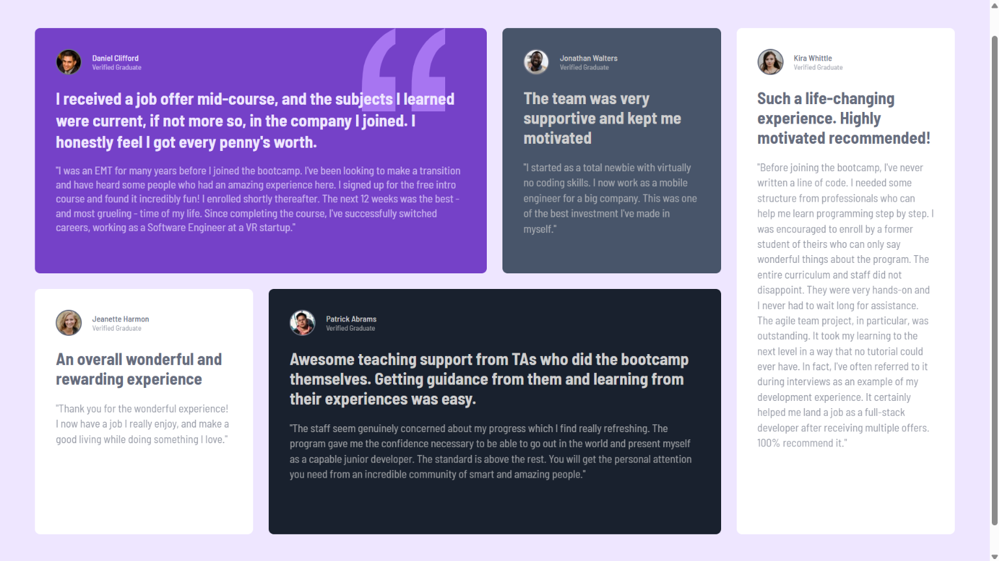

## Table of contents

- [Overview](#overview)
  - [The challenge](#the-challenge)
  - [Screenshot](#screenshot)
  - [Links](#links)
  - [My process](#my-process)
  - [Built with](#built-with)
  - [What I learned](#what-i-learned)
  - [Author](#author)

## Overview

### The challenge

Users should be able to:

- View the optimal layout for the site depending on their device's screen size

### Screenshot

### Links

- Solution URL: [solution URL](https://your-solution-url.com)
- Live Site URL: [live site URL](https://your-live-site-url.com)

## My process

### Built with

- HTML
- CSS custom properties
- Flexbox
- CSS Grid

### What I learned

I learned css grid and also interchanging divs positions and learnt more about media queries for different devices.

## Author

- Frontend Mentor - [@Unnati-Chaudhari](https://www.frontendmentor.io/profile/Unnati-Chaudhari)
- Twitter - [@yourusername](https://www.twitter.com/yourusername)

